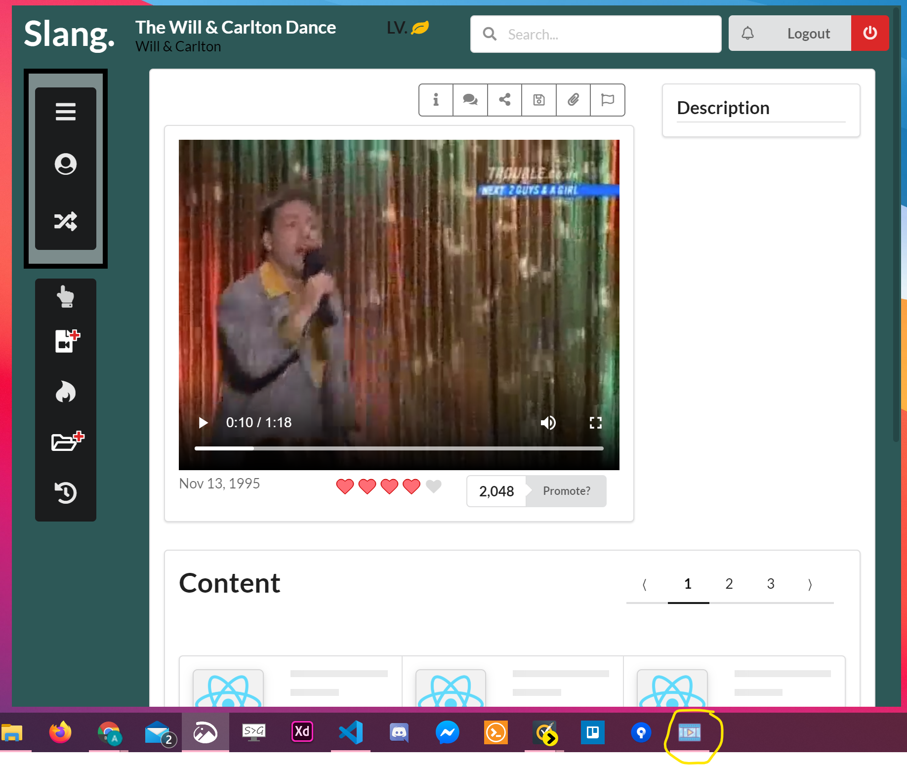

# Slang

A centralized CDN for content creators via Electron &amp; React. This project is currently still under development,
the screenshot below shows the app's current state. The video featured is streaming via the Google Cloud Platform.

## Local setup

The pre packaged version can be downloaded here (win-32 x64) [here](https://mega.nz/file/nzwhRaja#Oe-88V_XgtdP2d0W1eQ0Zqw1h83AGga9S2jqWIce6Ow).  
Or to setup locally

```
git clone https://github.com/AhmedAlihashi/Slang.git
cd Slang
npm install or yarn install
npm run start or yarn start
```

# Screenshots

<p float="left">
  
</p>
